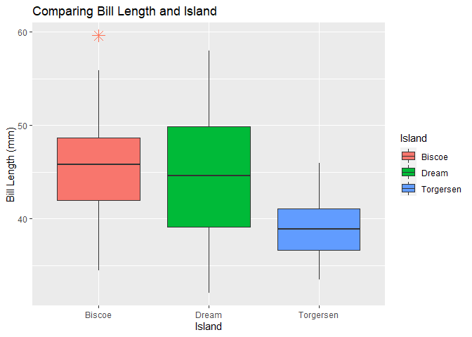
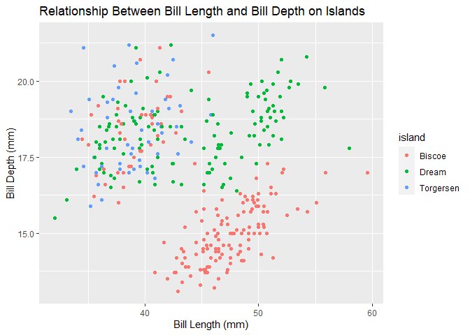

## Install Packages and Read Data 


```r
library(tidyverse)
```

```
## -- Attaching packages --------------------------------------- tidyverse 1.3.0 --
```

```
## v ggplot2 3.3.3     v purrr   0.3.4
## v tibble  3.0.4     v dplyr   1.0.2
## v tidyr   1.1.2     v stringr 1.4.0
## v readr   1.4.0     v forcats 0.5.0
```

```
## -- Conflicts ------------------------------------------ tidyverse_conflicts() --
## x dplyr::filter() masks stats::filter()
## x dplyr::lag()    masks stats::lag()
```

```r
library(palmerpenguins)
```

```
## Warning: package 'palmerpenguins' was built under R version 4.0.4
```

```r
penguins_data <- penguins
penguins_data
```

```
## # A tibble: 344 x 8
##    species island bill_length_mm bill_depth_mm flipper_length_~ body_mass_g
##    <fct>   <fct>           <dbl>         <dbl>            <int>       <int>
##  1 Adelie  Torge~           39.1          18.7              181        3750
##  2 Adelie  Torge~           39.5          17.4              186        3800
##  3 Adelie  Torge~           40.3          18                195        3250
##  4 Adelie  Torge~           NA            NA                 NA          NA
##  5 Adelie  Torge~           36.7          19.3              193        3450
##  6 Adelie  Torge~           39.3          20.6              190        3650
##  7 Adelie  Torge~           38.9          17.8              181        3625
##  8 Adelie  Torge~           39.2          19.6              195        4675
##  9 Adelie  Torge~           34.1          18.1              193        3475
## 10 Adelie  Torge~           42            20.2              190        4250
## # ... with 334 more rows, and 2 more variables: sex <fct>, year <int>
```


## Abstract

From the Palmer Penguins site, there were two datasets that could be explored. The penguin dataset is what is going to be explored for this project. The main purpose of this dataset is to give an example of great data to use for analysis and visualization. Many different variables are provided when the data is being presented. It is important to be able to  compare the size measurements of three different species of penguins on three different islands in Antarctica. To be specific this project will be more focused on how the size measurements vary compared to what islands that they live on. To accomplish this goal, the data analysis software of RStudio will be utilized. This will be helpful when downloading all of the data that is needed and when creating graphs to compare measurements. From there, the next step would be to have one measurement on the x-axis and one measurement on the y-axis and then add what islands the penguins are located on to see if there is a correlation. 

## Introduction


## Methods


### Data Acquisition 

- Data was taken from a website called "Palmer Penguins", which contains information about penguins on islands in Antartica (Horst et all, 2020).
- From the two datasets on the website, the penguins data is what was used.
- The packages of tidyverse and palmerpenguins were then installed and the data was read into RStudio (RStudio, 2020), using the readr package (Hadley and Jim, 2020).

### Data Preparation

- The data was renamed to penguins_data for easier usage and manipulation, using the dyplr package in RStudio (Hadley et all, 2020)
- A few graphs were then created for visual aid to look closer and to compare the data from the penguins
- Five graphs were created, including four scatterplots and one boxplot using the ggplot2 package in RStudio (H. Wickham, 2016)
- From there it is simple to visualize some trends in the graph and compare the size measurements of penguins and what island they live on

## Results

I first created a scatterplot in which I am seeing if there is a trend between bill depth and bill length within the three islands. 

```r
length_and_depth <- ggplot(data = penguins) +
  geom_point(mapping = aes(x = bill_length_mm, y = bill_depth_mm, color = island))
length_and_depth
```

```
## Warning: Removed 2 rows containing missing values (geom_point).
```

<!-- -->

I next added best fit lines to get a better view of what the trend actually is in each island. 

```r
length_and_depthline <- ggplot(data = penguins, aes(x = bill_length_mm, y = bill_depth_mm, color = island)) +
  geom_point() +
  geom_smooth(method = "lm", se = FALSE) +
  labs(title = "Relationship Between Size Measurements and Island",
       x = "Bill Length (mm)",
       y = "Bill Depth (mm)")
length_and_depthline
```

```
## `geom_smooth()` using formula 'y ~ x'
```

```
## Warning: Removed 2 rows containing non-finite values (stat_smooth).
```

```
## Warning: Removed 2 rows containing missing values (geom_point).
```

<!-- -->

For another comparison, I looked at the trend between flipper length and body mass of the penguins and what island they lived on.


```r
flipper_and_mass <- ggplot(data = penguins) +
  geom_point(mapping = aes(x = flipper_length_mm, y = body_mass_g, color = island))
flipper_and_mass
```

```
## Warning: Removed 2 rows containing missing values (geom_point).
```

<!-- -->

I again added best fit lines to this graph also. 


```r
flipper_and_massline <- ggplot(data = penguins, aes(x = flipper_length_mm, y = body_mass_g, color = island)) +
  geom_point() +
  geom_smooth(method = "lm", se = FALSE) +
  labs(title = "Relationship Between Size Measurements and Island",
       x = "Flipper Length (mm)",
       y = "Body Mass (g)")
flipper_and_massline
```

```
## `geom_smooth()` using formula 'y ~ x'
```

```
## Warning: Removed 2 rows containing non-finite values (stat_smooth).
```

```
## Warning: Removed 2 rows containing missing values (geom_point).
```

<!-- -->

I also wanted to compare just one numerical variable of flipper length of the penguins to what island that they lived on, so I created a boxplot, which showed that the island of Biscoe had penguins with the longest flipper length. 


```r
flipper_boxplot <- ggplot(penguins, aes(x=island, y=flipper_length_mm, color = island)) +
  geom_boxplot(notch=FALSE, outlier.colour="cadetblue3", outlier.shape=8,
               outlier.size=4)
flipper_boxplot
```

```
## Warning: Removed 2 rows containing non-finite values (stat_boxplot).
```

<!-- -->


## Discussion


## Literature Cited

  Hadley Wickham and Jim Hester (2020). readr: Read Rectangular Text Data. R
   package version 1.4.0. https://CRAN.R-project.org/package=readr

  Hadley Wickham, Romain François, Lionel Henry and Kirill Müller (2020). dplyr: A
   Grammar of Data Manipulation. R package version 1.0.2.
   https://CRAN.R-project.org/package=dplyr
  
  Horst AM, Hill AP, Gorman KB (2020). palmerpenguins: Palmer Archipelago
   (Antarctica) penguin data. R package version 0.1.0.
   https://allisonhorst.github.io/palmerpenguins/
  
  H. Wickham. ggplot2: Elegant Graphics for Data Analysis. Springer-Verlag New
    York, 2016.
  
  RStudio Team (2020). RStudio: Integrated Development Environment for R. RStudio,
    PBC, Boston, MA URL http://www.rstudio.com/.
