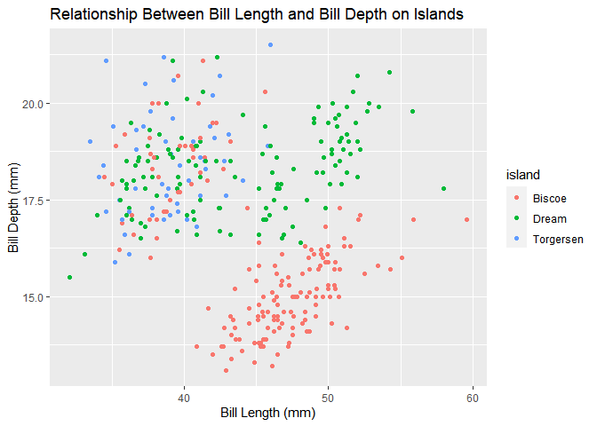
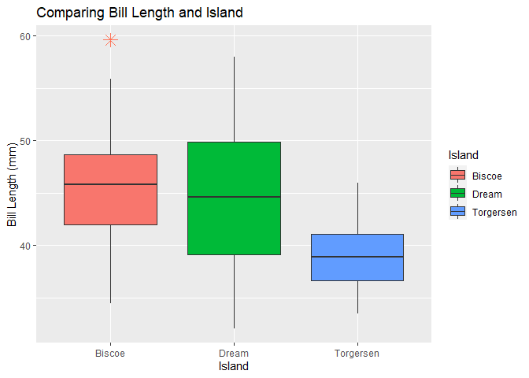
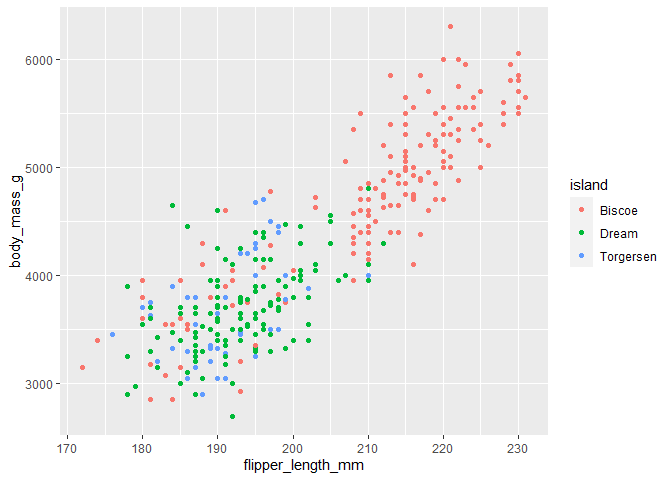
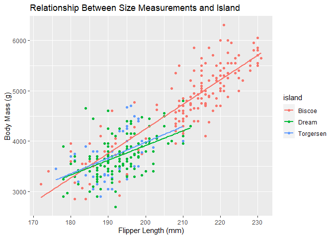
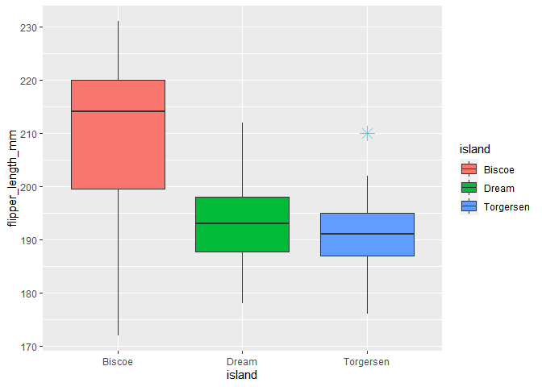
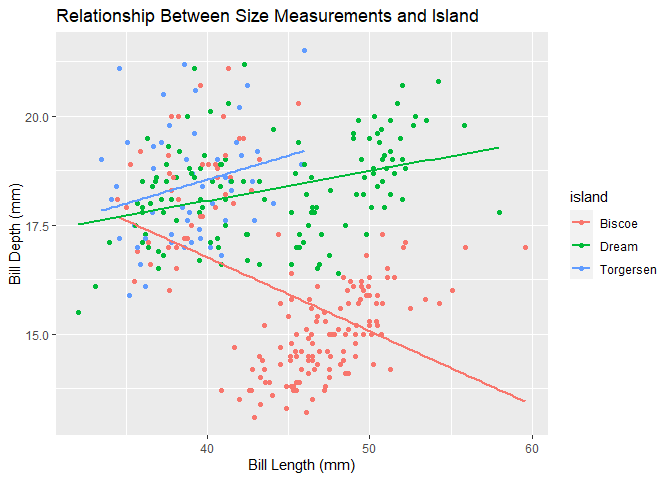
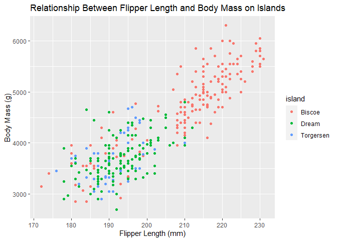
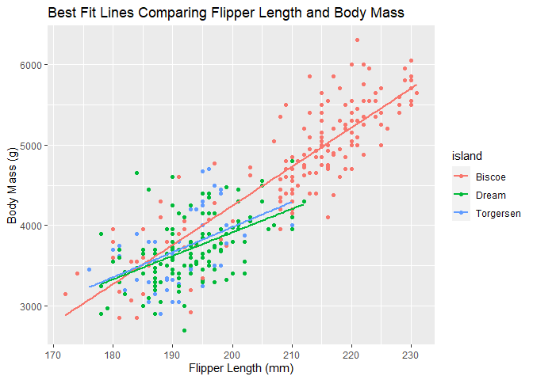
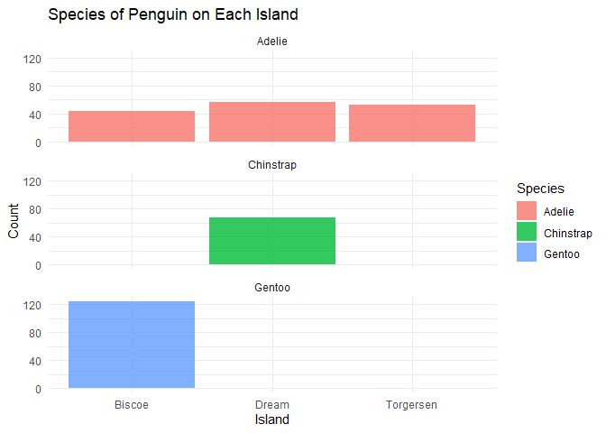

# Comparing Size Measurements of Penguins to What Island They Live On

Amara Miller

Instructor: Chris Merkord

Biosciences Department, Minnesota State University Moorhead, 1104 7th
Avenue South, Moorhead, MN 56563 USA

## Abstract

From the Palmer Penguins site, there were two datasets that could be
explored. The penguin dataset is what is going to be explored for this
project. The main purpose of this dataset is to give an example of great
data to use for analysis and visualization. Many different variables are
provided when the data is being presented. It is important to be able to
compare the size measurements of three different species of penguins on
three different islands in Antarctica. To be specific this project will
be more focused on how the size measurements vary compared to what
islands that they live on. To accomplish this goal, the data analysis
software of RStudio will be utilized. This will be helpful when
downloading all of the data that is needed and when creating graphs to
compare measurements. From there, the next step would be to have one
measurement on the x-axis and one measurement on the y-axis and then add
what islands the penguins are located on to see if there is a
correlation.

## Introduction

There is a wide range of research that is being studied at the Palmer
Long-Term Ecological Research study area. It is one of three research
stations located in Antartica, so that means their main focus is on the
marine ecosystem, which includes research on penguins. Three different
species of penguin were researched like the Adelie, Gentoo, and the
Chinstrap penguins.

The research also took place on three unique islands which are the
Biscoe, Dream, and Torgersen islands.

Each penguin species is going to adapt to its own unique environment on
a specific island. The objective is trying to figure out if there is
going to be a relationship between the size measurements of the penguin
and the island that it lives on. It would be interesting to see if the
size measurements of the penguins have any natural trend when they are
compared to what island they live on. If there are major trends, it
could be caused for a number of different reasons. One reason could
depend on what species of penguin might live on that island and how
large each of these species are, so that could cause an overall trend in
the data.

## Methods

### Data Acquisition

  - Data was taken from a website called “Palmer Penguins”, which
    contains information about penguins on islands in Antartica (Horst
    et all, 2020).
  - From the two datasets on the website, the penguins data is what was
    used.
  - There were exact instructions on the palmer penguins website for how
    to download the package and the correct code to use.
  - The packages of tidyverse and palmerpenguins were then installed and
    the data was read into RStudio (RStudio, 2020), using the readr
    package (Hadley and Jim, 2020).

### Data Preparation

  - The data was renamed to penguins\_data for easier usage and
    manipulation, using the dyplr package in RStudio (Hadley et all,
    2020).
  - A few graphs were then created for visual aid to look closer and to
    compare the data from the penguins.
  - Many different graphs were then created, including four scatterplots
    and four boxplots using the ggplot2 package in RStudio (H. Wickham,
    2016).
  - From there it is simple to visualize some trends in the graph and
    compare the size measurements of penguins and what island they live
    on.

## Results

I first created many different boxplots to compare each size measurement
to what island the penguins lived on. I wanted to compare just one
numerical variable of flipper length of the penguins to what island that
they lived on, so I created a boxplot, which showed that the island of
Biscoe had penguins with the longest flipper length.

<!-- -->

The next comparison is the bill length of the penguin to what island it
lives on.

<!-- -->

Another measurement that I compared to what island the penguin lived on
was the depth of the bill.

<!-- -->

The final comparison is the body mass of each penguin compared to the
island that they live on.

<!-- -->

I then created a scatterplot in which I am seeing if there is a trend
between bill depth and bill length within the three islands.
<!-- -->

I next added best fit lines to get a better view of what the trend
actually is in each island.
<!-- -->

I couldn’t really see a natural trend from that graph from any of the
size measurements, so I decided to go another route and see if there was
a trend with flipper length and body mass compared to the island.

<!-- -->

I could kind of tell that there was a little bit of a trend, but to get
a better look I made the graph have best fit lines.

<!-- -->

From there I wanted to create a graph to represent what species of
penguin was on each island to determine the trends I was seeing.

<!-- -->

## Discussion

After all of the results were found, it was kind of challenging to
really compare the size measurements of penguins to what island they
live on. There is not much research out there that digs deep into this
concept, whether there is a trend in the data or there isn’t. Some
things that were discovered in this data had to do with the island of
Biscoe. After creating those four boxplots, it was easy to notice that
Biscoe had penguins with the largest flipper length and it had penguins
with the largest body mass. From there, another graph was created to see
if there was some sort of correlation. After making the scatterplot with
the flipper length on the x-axis and the body mass on the y-axis, there
seemed to be a visual trend going on with the island of Biscoe. With the
best fit lines, the island of Biscoe had a positive slope, which showed
that there was a positive correlation. One reason that this would happen
would be depending on what kind of penguins might happen to live on that
island. A graph was then made that showed how many of each species of
penguin was located on each island. This graph showed that the island of
Biscoe mainly had the Gentoo penguin. The positive correlation with
flipper length and body mass made sense, because the Gentoo species is
the largest of the three species. Also from that same graph, it is
noticable that the species of penguins aren’t spread out that much, so
that is another reason why it was kind of difficult to notice more
trends throughout the data. Some more results I got showed how the
island of Torgersen had the largest bill depth and how the island of
Dream had the longest bill length. Overall, it is was easy to notice one
major trend throughout the data and some other small results shown
through other graphs like scatterplots and boxplots. These results show
how it is important to get a wide spread of data in order to be able to
see more prominant trends.

## References

  - Hadley Wickham and Jim Hester (2020). readr: Read Rectangular Text
    Data. R package version 1.4.0.
    <https://CRAN.R-project.org/package=readr>

  - Hadley Wickham, Romain François, Lionel Henry and Kirill Müller
    (2020). dplyr: A Grammar of Data Manipulation. R package version
    1.0.2. <https://CRAN.R-project.org/package=dplyr>

  - Horst AM, Hill AP, Gorman KB (2020). palmerpenguins: Palmer
    Archipelago (Antarctica) penguin data. R package version 0.1.0.
    <https://allisonhorst.github.io/palmerpenguins/>

  - H. Wickham. ggplot2: Elegant Graphics for Data Analysis.
    Springer-Verlag New York, 2016.

  - RStudio Team (2020). RStudio: Integrated Development Environment for
    R. RStudio, PBC, Boston, MA URL <http://www.rstudio.com/>.
